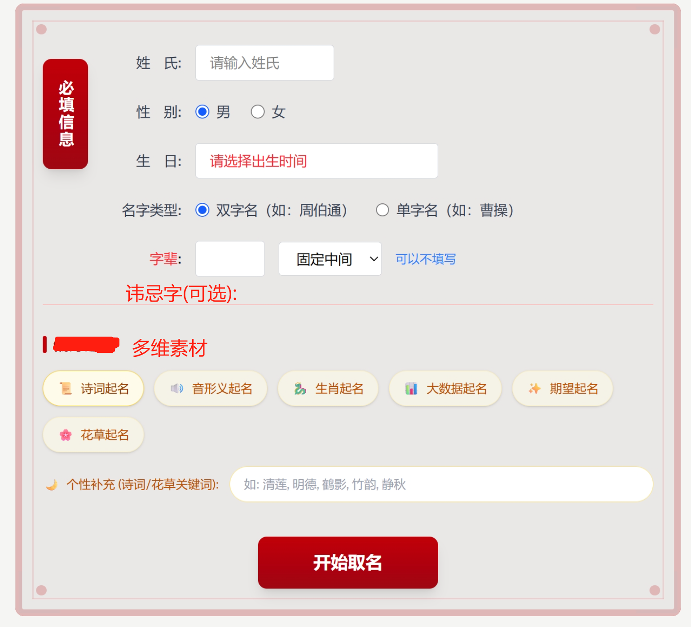
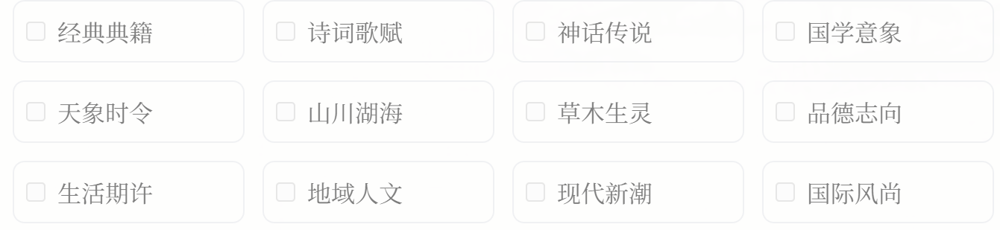
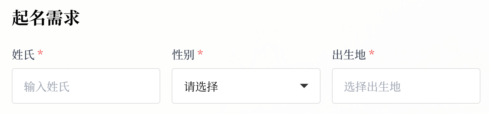
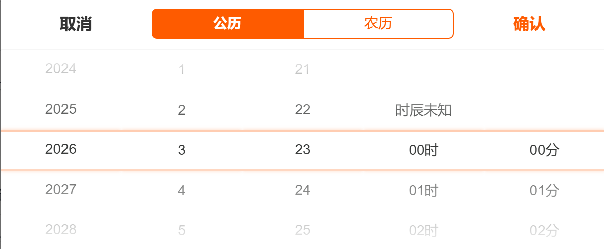
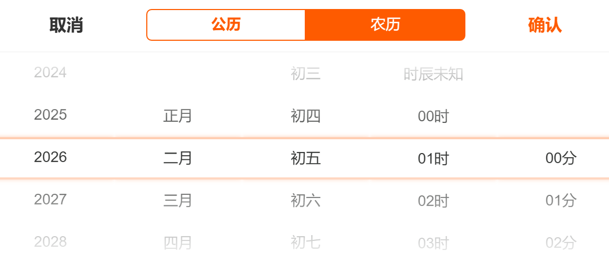
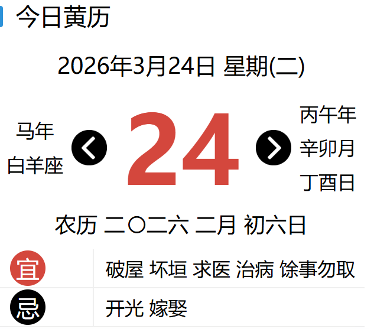
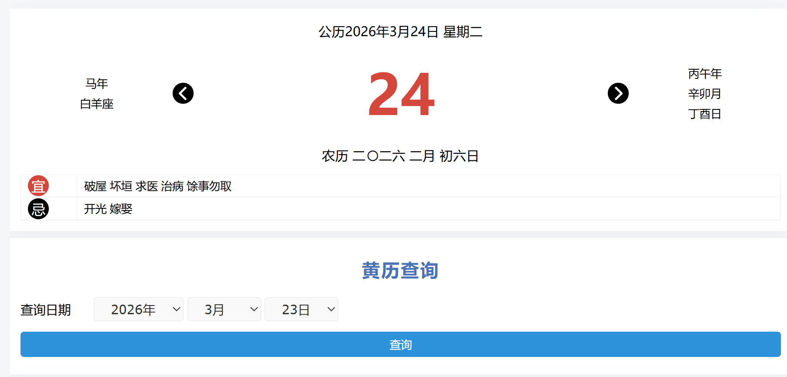
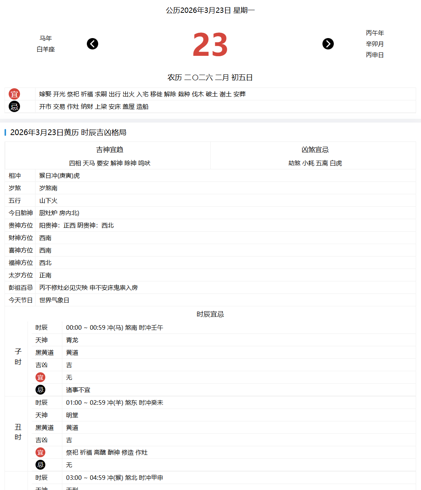
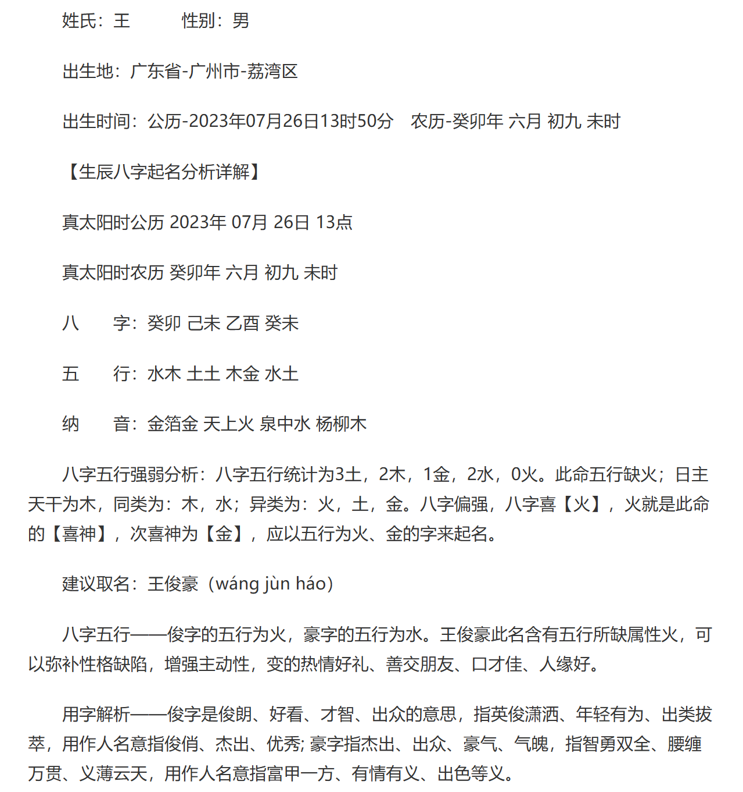
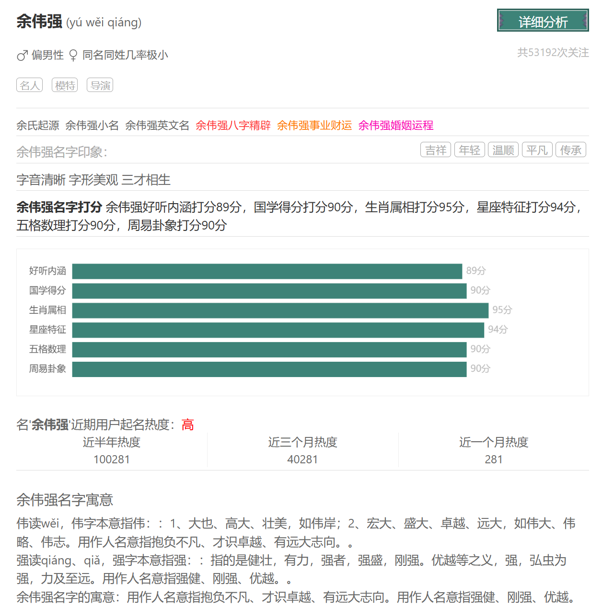

### 前端页面

#### 起名主页展示页面

#### 多维起名素材类型

- 传统文化经典

  从《诗经》、《楚辞》、《论语》、《唐诗宋词》等经典文学作品中选取富有文化内涵的字词。例如：

  - 《诗经》：如"静姝"（《邶风·静女》）、"清扬"（《郑风·野有蔓草》）
  - 《楚辞》：如"灵均"（屈原自号）、"修远"（路漫漫其修远兮）
  - 唐诗：如"子衿"（李白诗）、"望舒"（月神名，常见于唐诗）

- 自然景物

  自然界的山川河流、日月星辰、花草树木等都是很好的起名素材：

  - 山水：如"知川"、"若山"、"慕峰"、"观澜"
  - 天文：如"星辰"、"子轩"（轩指北斗星）、"望舒"（月神）
  - 植物：如"芷兰"、"竹青"、"秋菊"、"松风"

- 美德品质

  以美德或美好品质命名，寄托对孩子的期望：

  - 德行：如"弘毅"、"明德"、"知礼"、"守信"
  - 智慧：如"思远"、"明智"、"睿哲"、"慧心"
  - 志向：如"志远"、"鸿鹄"、"凌霄"、"鹏飞"

- 现代文化元素

  结合现代文化、科技、艺术等元素：

  - 科技：如"星辰"、"星云"、"宇航"
  - 艺术：如"诗韵"、"画境"、"墨染"
  - 现代理念：如"知行"、"合一"、"思齐"

#### 出生日期时间弹窗样式

#### 黄历展示

- **黄历基本信息**：显示公历、农历日期，以及对应的天干地支、节气、节日等信息。
- **吉凶宜忌**：详细展示当日的宜、忌事项，帮助用户了解当日的适宜活动和需要避免的事项。
- **十二值日**：显示当日的值日星神，如青龙、明堂、天刑等，以及对应的黄道/黑道日信息。
- **十二建星**：展示建、除、满、平、定、执、破、危、成、收、开、闭等十二建星信息。
- **五行信息**：显示当日的五行属性，以及与五行相关的运势分析。

#### 万年历展示

- **月历视图**：提供完整的月历视图，同时显示公历和农历日期，方便用户快速查看整月的日期信息。
- **节气标记**：在月历中标记二十四节气的位置，帮助用户了解节气变化。
- **节日显示**：显示传统节日和现代节日，方便用户了解重要日期。
- **农历信息**：在月历中显示农历日期、干支、节气等信息。

#### 日期查询功能

- **日期选择器**：提供直观的日期选择界面，支持年、月、日的快速选择。
- **范围查询**：支持查询指定日期范围内的黄历信息。
- **条件筛选**：支持根据特定条件（如黄道吉日、宜事项等）筛选日期。
- **历史查询**：支持查询历史日期的黄历信息，方便用户了解过去的黄历数据。
- **未来查询**：支持查询未来日期的黄历信息，帮助用户提前规划活动。

#### 报告样式

### 评分维度

- 萃取经史子集、诗词歌赋、自然意象等多元灵感，蕴含雅致意蕴与吉祥期许，兼具文化厚度与独特韵味，耐人寻味且彰显格调。
- 优选笔画疏密得当、重心平衡的常用字，兼顾繁简适配与书写美感，视觉上协调舒展，尽显端庄雅致。
- 融合八字五行、紫微斗数及《周易》卦象，名字能量与命理格局相生相融，避免机械堆砌。
- 

### 名字强制约束条件

- 避免生僻字名字：使用过于生僻字会带来诸多不便
- 避免谐音不雅名字
- 避免笔画过于复杂名字：笔画过多的汉字会增加书写难度
- 避免时代感过强名字或外语生硬汉化名（如：汤姆等）
- 避免含义消极名字
- 避免洋化过度名字：完全西化或生硬翻译的名字可能与中华文化背景不协调

### 好名字特色

- #### 音律之美

  - 避免声母或韵母连续重复，如"张章"、"李丽"
  - 名字最后一个字最好使用开口音，如"亮"、"阳"、"航"
  - 平仄搭配合理，读起来抑扬顿挫
  - 整体音调和谐，避免过于拗口

- #### 字形之美

  - 字形结构搭配协调，避免全是左右结构或上下结构
  - 笔画数量平衡，不要相差过于悬殊
  - 书写流畅，视觉上美观大方
  - 注意名字的间架结构，整体协调
  
- #### 字义之美

  - 寓意积极向上，富有正能量
  - 名字与姓氏结合有美好含义
  - 可以结合家族文化或期望
  - 避免字面意思过于直白或浅薄

- 生辰八字起名字是按生辰取名是遵循以“中和为贵”，是以生辰“中和”最好。若是五行当中的某一个属性过强又或者是过于弱了，那么命中格局就会失去平衡，进而影响到人的一生运势。此时需要通过取一个相得益彰的名字，用名字的属性和笔画数来弥补，以此达到“中和”的最佳状态，改善人的运势。

### 常见误区

- #### 忽略方言发音

  在某些方言中，原本正常的名字可能有不好的谐音。

- #### 过于追求寓意堆砌

  将过多美好的寓意堆砌在名字中，导致名字过于复杂或不自然

- #### 跟风名人名字

  盲目模仿名人或流行文化中的名字，缺乏个性和文化内涵。

- #### 盲目追求独特

  为了避免重名，过度追求独特性，使用生僻字或拼凑的名字，导致实用性差。

- #### 忽视性别特征

  名字过于中性或不符合性别特征，可能导致社交中的误解。

## 素材

### 黄历

老黄历是一种带有每日吉凶宜忌的一种万年历，是同时显示公历、农历和干支历等多套历法，并附加大量与趋吉避凶相关的规则和内容的历书。传说以黄帝时创造的历法为最古，所以人们就把历法称为“黄历”。黄历又称作皇历，有的地方称为老黄历、老皇历、农历、阴历、择吉老黄历等不同的名称。黄历主要内容为二十四节气的日期表，每天的吉凶宜忌、生肖运程等。即古人把每一天的喜忌都记在日历上，作行动指南。中国老黄历古代的历法就是一种编算天文年历的工作。它包括中国古代天文学的许多重要内容，是古代科学观察和研究的结晶。

老黄历术语解释：

黄道、黑道日：

黄道、黑道的推算方法主要有两种，一种是十二地支配上十二个天神。另一种是十二值。

十二值日星神：

子日青龙；丑日明堂；寅日天刑；卯日朱雀；辰日金贵；巳日天德；午日白虎；未日玉堂；申日天牢；酉日玄武；戌日司命；亥日勾陈。凡是逢上青龙、明堂、金贵、天德、玉堂、司命六神的就是黄道吉日。其他，则为黑道日。

十二建星：

十二建星，又称为建除十二值，就是十二个星轮流值日， 十二个星分别是：建、除、满、平、定、执、破、危、成、收、开、闭。

二十四节气：

立春、雨水、惊蛰、春分、清明、谷雨、立夏、小满、芒种、夏至、小暑、大暑、立秋、处暑、白露、秋分、寒露、霜降、立冬、小雪、大雪、冬至、小寒、大寒。

### 十二生肖

十二生肖的顺序表是鼠、‌牛、‌虎、‌兔、‌龙、‌蛇、‌马、‌羊、‌猴、‌鸡、‌狗、‌猪。‌这一顺序不仅是中国民间计算年龄的方法，‌也是一种古老的纪年法。‌

### 八字五行

八字五行是中国传统命理学的核心概念，它将人出生的年月日时（即“四柱”）转化为天干地支，再对应五行（金、木、水、火、土）的生克关系，来分析一个人的性格、运势等。下面为你系统介绍。

#### 一、基本构成：四柱与八字
一个人的出生年、月、日、时，分别用一对天干+地支来表示，共四对，称“四柱”：
- **年柱**：出生年份的干支
- **月柱**：出生月份的干支（以节气为界）
- **日柱**：出生当日的干支（核心，代表自身）
- **时柱**：出生时辰的干支

每柱一干一支，共八个字，故称“八字”。

#### 二、天干地支的五行属性
##### 1. 十天干
- **木**：甲（阳）、乙（阴）
- **火**：丙（阳）、丁（阴）
- **土**：戊（阳）、己（阴）
- **金**：庚（阳）、辛（阴）
- **水**：壬（阳）、癸（阴）

##### 2. 十二地支
地支本身有主气五行，还藏有其他五行（藏干），是分析的关键：
- **寅、卯**：属木（寅藏甲、丙、戊；卯藏乙）
- **巳、午**：属火（巳藏丙、戊、庚；午藏丁、己）
- **申、酉**：属金（申藏庚、壬、戊；酉藏辛）
- **亥、子**：属水（亥藏壬、甲；子藏癸）
- **辰、戌、丑、未**：属土（称为四库，各藏不同：辰藏乙、戊、癸；戌藏辛、丁、戊；丑藏己、癸、辛；未藏丁、乙、己）

#### 三、五行生克关系
这是八字分析的核心逻辑：

**相生**（促进、滋养）：

金生水，水生木，木生火，火生土，土生金。金生水：金销熔生水；水生木：水润泽生木；木生火：木干暖生火；火生土：火焚木生土；土生金：土矿藏生金。

五行相生含义：

金生水——因为少阴之气(金气)温润流泽，金靠水生，销锻金也可变为水，所以金生水。

水生木——因为水温润而使树木生长出来，所以水生木。

木生火——是因为木性温暖，火隐伏其中，钻木而生火，所以木生火。

火生土——是因为火灼热，所以能够焚烧木，木被焚烧后就变成灰烬，灰即土，所以火生土。土生金——因为金需要隐藏在石里，依附着山，津润而生，聚土成山，有山必生石，所以土生金。

**相克**（制约、消耗）：

金克木，木克土，土克水，水克火，火克金。

五行相克含义：是因天地之性 众胜寡，故水胜火；精胜坚，故火胜金；刚胜柔，故金胜木；专胜散，故木胜土；实胜虚，故土胜水。

刚胜柔，故金胜木；因为刀具可砍伐树木；

专胜散，故木胜土；因为树木可稳住崩土；

实胜虚，故土胜水；因为堤坝可阻止水流；

众胜寡，故水胜火；因为大水可熄灭火焰；

精胜坚，故火胜金；因为烈火可溶解金属。

金赖土生，土多金埋；土赖火生，火多土焦；火赖木生，木多火炽；木赖水生，水多木漂；水赖金生，金嗨 恰?

金能生水，水多金沉；水能生木，木多水缩；木能生火，火多木焚；火能生土，土多火晦；土能生金，金多土弱。

金能克木，木坚金缺；木能克土，土重木折；土能克水，水多土流；水能克火，火炎水灼；火能克金，金多火熄。

金衰遇火，必见销熔；火弱逢水，必为熄灭；水弱逢土，必为淤塞；土衰逢木，必遭倾陷；木弱逢金，必为斫折。

强金得水，方挫其锋；强水得木，方缓其势；强木得火，方泄其英；强火得土，方敛其焰；强土得金，方化其顽。

#### 四、十神：五行关系的社会化演绎
将日干（代表自身）与其他干支的五行进行生克、阴阳对比，形成十种关系，称“十神”，用以解读性格、六亲、事业等：
- **比肩、劫财**：与日干同五行
- **正印、偏印**：生我（日干）者
- **食神、伤官**：我生者
- **正财、偏财**：我克者
- **正官、七杀**：克我者

#### 五、旺衰与平衡
八字分析中，“日主”（日干）的旺衰是关键。通过分析八字中其他七个字对日主的生扶或克泄耗，来判断五行的强弱。
- **偏旺**：需用克、泄、耗来平衡（取用神）
- **偏弱**：需用生、扶来助身（取用神）

理想状态是五行流通、阴阳平衡，但极少有完美八字，大多通过“用神”和“忌神”来调候补救。

### 紫微斗数

**紫微斗数**是中国传统命理学中一个非常精密、系统的分支，与八字（子平术）并称两大主流。如果说八字是用“五行生克”的逻辑推演人生轨迹，那么紫微斗数则更像一幅描绘人生全貌的**“星空地图”**。

它通过将人的出生年月日时转化为一套复杂的星盘，分析上百颗星曜在十二宫位的分布与互动，从而推断性格、六亲、事业、财富、灾厄等。

#### 一、核心架构：十二宫与命盘
紫微斗数的基本单位是“宫位”，每个人的命盘由12个宫位组成，逆时针排列，涵盖了人生的所有面向：

1.  **命宫**：核心中的核心。代表命主整体格局、个性、天赋、容貌。看盘必先看命宫。
2.  **兄弟宫**：看兄弟姐妹缘分、助力，也兼看合作对象、同学关系。
3.  **夫妻宫**：看配偶性格、婚姻关系、恋爱模式。
4.  **子女宫**：看子女缘、子女性格，也关联性能力、桃花运（婚后）、下属关系。
5.  **财帛宫**：看赚钱能力、理财观念、现金流动状况。
6.  **疾厄宫**：看先天体质、易患疾病、灾厄，也反映脾气性格。
7.  **迁移宫**：看外出运、在外的际遇、人际关系（社会上给人的印象）。
8.  **交友宫**：看朋友、同事、客户关系，以及人际交往的广度。
9.  **官禄宫**：看事业运、适合的行业、工作能力、管理能力。
10. **田宅宫**：看家庭环境、房产运、祖业继承，也代表内心的安全感。
11. **福德宫**：看精神世界、享福能力、思想深度、晚年福气。
12. **父母宫**：看父母性格、与父母的缘分，也代表文书、政府机关（官司）。

#### 二、星曜体系：满天星辰的等级
紫微斗数的核心在于“星”，并非真实天文星体，而是符号化的神煞系统。主要分为几大阵营：

##### 1. 甲级星（主星，14颗）
-   **紫微星系（6颗，逆排）**：紫微、天机、太阳、武曲、天同、廉贞。
-   **天府星系（8颗，顺排）**：天府、太阴、贪狼、巨门、天相、天梁、七杀、破军。
-   **关键**：这14颗主星中，以**紫微星**为北斗帝星，代表尊贵与领导力；天府为南斗帝星，代表库藏与稳重。命宫落入不同主星，决定了人的基本性格基调（如：紫微威严、天机聪明、贪狼多才多欲）。

##### 2. 辅星（乙、丙、丁级星）
它们像佐料，起“加强”、“转化”、“破坏”作用：
-   **六吉星**：左辅、右弼（助贵人缘）、文昌、文曲（助才华）、天魁、天钺（助机遇）。
-   **六煞星**：火星、铃星（急性、爆发）、擎羊、陀罗（血光、拖延）、地空、地劫（破财、空虚）。
-   **四化星（核心）**：化禄（财运）、化权（权势/掌控）、化科（名声/文质）、化忌（障碍/执念）。这是紫微斗数“活起来”的关键，同一颗星在不同宫位四化，吉凶天差地别。

#### 三、排盘逻辑：天地人的结合
紫微斗数排盘极为严谨，融合了天文历法与数理模型：
1.  **天干地支定局**：根据出生年月日时，先排“天干”定五行局（水二局、木三局等）。
2.  **安命宫、身宫**：
    -   **命宫**：先天运势，1-30岁的重心。
    -   **身宫**：后天发展，30岁后后天努力的方向，往往代表一个人后半生最重视的领域（如身宫在财帛，后半生重理财；在官禄，重事业）。
3.  **定十二宫**：从命宫起逆时针排十二宫。
4.  **定十二宫天干**：结合生年年干，安“生年天干”到各宫。
5.  **定五行局**：由命宫天干地支推算得出，决定紫微星的位置。
6.  **安主星**：先安紫微星，再逆时针排紫微星系；接着安天府星，顺时针排天府星系。
7.  **安辅星、四化**：根据生年天干安禄存、擎羊等；根据生年地支安左辅右弼等；根据生年天干“四化诀”（甲廉破武阳...）安四化星。

#### 四、特殊格局：命运的简化模型
当某些星曜在特定宫位组合时，会形成“格局”，往往代表一种典型命运：
-   **杀破狼**（七杀、破军、贪狼在命宫三合）：动荡、开创、大起大落，多为冒险家、创业者。
-   **机月同梁**（天机、太阴、天同、天梁在命宫三合）：公职、文职、稳定，适合做幕僚、技术人员。
-   **紫府同宫**（紫微天府在命宫）：帝王气质，极强，但也容易孤傲、保守。
-   **火贪格**（火星+贪狼在命/财帛）：爆发横财，但来得快去得快。

#### 五、紫微斗数 vs. 八字
两者同为命理，但逻辑侧重不同：

| 维度       | 紫微斗数                         | 八字（子平术）                 |
| :--------- | :------------------------------- | :----------------------------- |
| **核心**   | 星曜、宫位、格局                 | 五行、生克制化、十神           |
| **视角**   | 空间感强（十二宫布局）           | 时间感强（大运流年流动）       |
| **直观性** | 像看3D地图，人事分宫明确         | 像看化学方程式，需推算五行平衡 |
| **特长**   | 细节精准（性格、六亲、具体事件） | 宏观趋势（气运起伏、生死大关） |

### 《周易》卦象

《周易》被誉为“群经之首，大道之源”，是中国古代哲学、命理、术数的总源头。

#### 一、核心构成：卦爻系统
《周易》由**经**与**传**两部分组成：
- **经**：即六十四卦的卦符、卦名、卦辞，以及每卦六爻的爻辞。相传为周文王所作。
- **传**：即《十翼》，是对经的解释，包括《彖传》《象传》《系辞》等，相传为孔子及其后学所作。

##### 1. 爻：最小的单元
- 爻分两种：**阳爻（—）** 和**阴爻（- -）**。
- 阳爻象征主动、刚健、光明；阴爻象征被动、柔顺、暗昧。
- 每卦由六爻组成，从下往上数，分别称为初爻、二爻、三爻、四爻、五爻、上爻。

##### 2. 八卦：三爻的基本卦
六十四卦由八个基本卦两两重叠而成。这八个基本卦称为“经卦”，每卦三爻，分别象征自然界的八种基本元素：

| 卦名 | 符号 | 象征 | 自然 | 属性 | 方向 |
| :--: | :--: | :--: | :--: | :--: | :--: |
|  乾  |  ☰   |  天  |  健  | 刚健 | 西北 |
|  坤  |  ☷   |  地  |  顺  | 柔顺 | 西南 |
|  震  |  ☳   |  雷  |  动  | 震动 |  东  |
|  巽  |  ☴   |  风  |  入  | 渗透 | 东南 |
|  坎  |  ☵   |  水  |  陷  | 险陷 |  北  |
|  离  |  ☲   |  火  |  丽  | 附丽 |  南  |
|  艮  |  ☶   |  山  |  止  | 静止 | 东北 |
|  兑  |  ☱   |  泽  |  悦  | 喜悦 |  西  |

这八个卦两两相重，就形成了六十四卦。例如：乾下乾上仍是“乾为天”；坤下艮上是“地山谦”。

---

#### 二、六十四卦的排列逻辑
六十四卦的排序并非随意，传统上以《序卦传》解释其因果关联：

- **首卦：乾、坤**  
  《乾》卦象征创始、天道、君父；《坤》卦象征承载、地道、臣母。有天地然后万物生，故乾坤居首。

- **终卦：既济、未济**  
  《既济》是“已经渡河”，象征完成；《未济》是“尚未渡河”，象征未完成。以未济结尾，寓意事物发展永无止境，循环往复。

- **中间排列**：从《屯》蒙》开始，讲述万物初生、蒙昧、需求、争讼、战争……到《革》《鼎》的改革鼎新，再到《震》《艮》的动静相宜，构成一套完整的宇宙与社会演化模型。

---

#### 三、卦象的解读方法
解读一卦，通常从以下几个层面入手：

##### 1. 卦辞与爻辞
- **卦辞**：总论整卦的吉凶大方向。例如《乾》卦辞：“元亨利贞”——创始、通达、和谐、贞正。
- **爻辞**：每一爻的具体断语，说明在该卦情境下，处于不同位置（阶段）时应如何应对。

##### 2. 彖传与象传
- **彖传**：解释卦辞，说明卦的构成原理与核心义理。
- **大象传**：从卦象（上下两卦的组合）推导出人事的启示。例如《屯》卦，上坎水、下震雷，水雷交加，象征初生之艰难，故大象说：“云雷屯，君子以经纶”——君子要像治理乱丝一样，筹划经营。
- **小象传**：解释每一爻的爻辞。

##### 3. 爻位关系
解读卦象时，爻与爻之间的位置关系极为关键：

- **当位**：阳爻居阳位（初、三、五），阴爻居阴位（二、四、上），为“当位”，象征得位、得正。反之则“不当位”。
- **中位**：二爻（下卦中位）和五爻（上卦中位）称为“中位”。居中象征守中道、不偏激。尤其五爻为君位，最为尊贵。
- **承乘**：下爻对上爻的关系。阴爻在阳爻之下为“承刚”，象征顺承；阳爻在阴爻之上为“乘柔”，有时象征居高临下。
- **应与**：初爻与四爻、二爻与五爻、三爻与上爻，若一阴一阳则为“有应”，象征内外呼应；同阴同阳则为“无应”，象征孤立。

---

#### 四、变卦与动爻：活用的关键
《周易》不是静态的占卜，其精髓在于“变易”。

- **动爻**：在占卜时（如用蓍草或铜钱），某一爻会发生变化，阳爻变阴爻，阴爻变阳爻。
- **本卦**：原卦象，代表当前状况。
- **变卦**：动爻变化后形成的新卦，代表发展趋势或结果。
- **互卦**：本卦中二、三、四爻组成下互卦，三、四、五爻组成上互卦，代表事物发展过程中的内在因素。

例如：占得《乾》卦，初爻动，则本卦为乾，变卦为《姤》（天风姤）。解读时需结合本卦卦辞、动爻爻辞、变卦卦辞综合判断。

