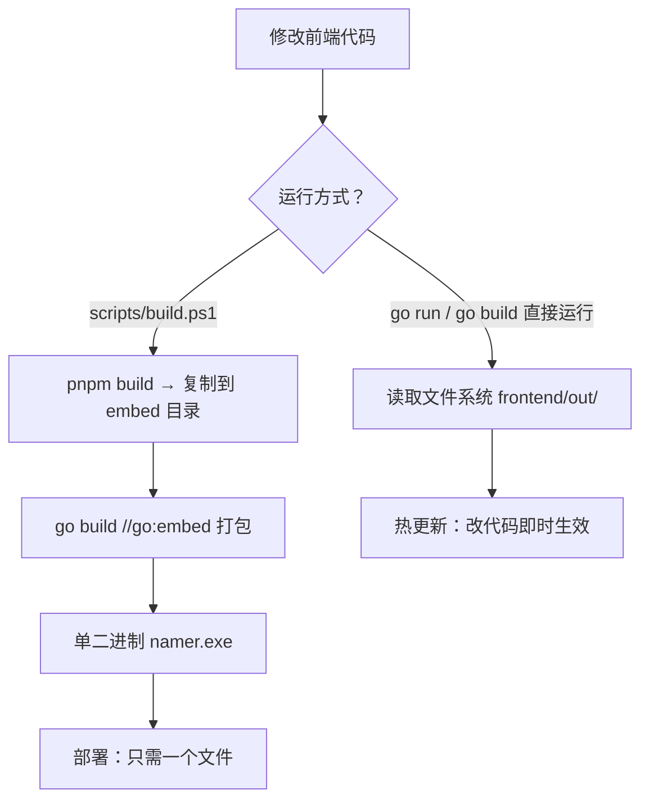

# 🍼 起名 (Namer) 部署使用手册

***

## 📖 文档目的

本文档旨在提供起名项目的详细部署指南，帮助开发人员和运维人员快速部署、配置和维护该项目。

***

## 🚀 部署架构

### 系统架构

```
┌─────────────────────────────────────────┐
│         单二进制可执行文件                │
│  ┌─────────────────────────────────────┐│
│  │  嵌入式静态文件 (embed.FS)           ││
│  │  (Next.js 构建产物 - 编译时内嵌)     ││
│  └─────────────────────────────────────┘│
│  ┌─────────────────────────────────────┐│
│  │  后端服务 (Go + Gin)                ││
│  │  API 路由 /api/v1/*                 ││
│  └─────────────────────────────────────┘│
│                    │                     │
│                    ▼                     │
│          ┌─────────────────┐            │
│          │  存储层         │            │
│          │ (SQLite/内存)   │            │
│          └─────────────────┘            │
└─────────────────────────────────────────┘
```

**核心特性：**
- **Go 1.16+ `//go:embed` 技术**：前端静态文件在**编译时**打包进二进制，运行时无需外部文件依赖
- **真正单文件部署**：仅一个 `.exe` 文件，包含前端页面 + 后端 API + 静态资源（CSS/JS/图片）
- **无需 Node.js 运行环境**：部署机器不需要安装 Node.js 或 pnpm

***

## 📋 环境要求

### 前端环境

| 依赖    | 版本     | 安装命令                                          |
| ------- | -------- | ------------------------------------------------- |
| Node.js | ≥ 18.0.0 | [Node.js官网](https://nodejs.org/zh-cn/download/) |
| pnpm    | ≥ 8.0.0  | `npm install -g pnpm` 或 `corepack enable`        |
| Next.js | ≥ 16.2.9 | `pnpm add next@latest`                            |

### 后端环境

| 依赖 | 版本      | 安装命令                               |
| ---- | --------- | -------------------------------------- |
| Go   | ≥ 1.25.10 | [Go官网](https://golang.google.cn/dl/) |
| Gin  | 1.9.x     | `go get -u github.com/gin-gonic/gin`   |

### 生产环境建议

| 组件         | 建议配置                     | 用途                   |
| ---------- | ------------------------ | -------------------- |
| 服务器        | 2核4G以上                   | 运行 namer.exe 服务     |
| 操作系统       | Ubuntu 22.04 / CentOS 8+ | 稳定的服务器环境            |
| Nginx      | 1.18+                    | 反向代理、SSL 终止、负载均衡    |
| SQLite     | 3.x（内置，无需额外安装）           | 数据持久化                |
| systemd    | -                        | 服务管理、自动重启           |

> **embed 模式下，Node.js / PM2 不再是生产环境必需组件。**
> 前端静态文件已嵌入 `namer.exe`，生产机器仅需运行 Go 二进制即可。

***

## 📦 部署方式

### 方式一：直接运行EXE（快速部署 — 推荐）

**适用场景：** 本地开发、测试环境、小型部署、生产部署

**特点：**
- **真正的单文件部署**：前端静态文件已通过 `//go:embed` 编译进二进制，只需一个 `.exe` 文件
- 后端使用 `--port` 参数指定端口，前端自动适配
- 支持动态端口配置，无需修改前端代码
- 使用 `--mode all` 时，后端同时提供前端静态文件服务（**推荐**）

**步骤：**

1. **获取可执行文件**

   **方式A：直接下载构建产物**
   - 从项目的 `dist/` 目录（运行 `scripts/build.ps1` 后生成）获取 `namer.exe`
   - 仅这一个文件即可运行，无需任何其他文件

   **方式B：自行构建**
   ```bash
   # 项目根目录执行一键构建脚本
   .\scripts\build.ps1 -Mode all

   # 构建产物在 dist/ 目录：
   #   dist/namer.exe     ← 唯一需要的文件（内嵌前端）
   ```

2. **运行服务**
   ```bash
   # 运行服务（默认端口8080）
   .\namer.exe -mode all

   # 访问 http://localhost:8080
   ```

3. **参数选项**
   ```bash
   # 指定端口（前端自动适配）
   .\namer.exe -mode all -port 8083
   # 访问 http://localhost:8083

   # 指定主机
   .\namer.exe -mode all -host 0.0.0.0

   # 组合使用
   .\namer.exe -mode all -host 0.0.0.0 -port 8083

   # 使用 SQLite 持久化存储（生产推荐）
   .\namer.exe -mode all -db sqlite -dsn name.db
   ```

**端口适配说明：**

- 前端使用相对路径 `/api`，自动适配当前访问端口
- 无论后端运行在哪个端口（8080、8083、8084等），前端都能正确访问API
- 无需修改前端代码，只需在启动时指定 `--port` 参数

### 方式二：前后端分离部署（开发模式）

**适用场景：** 本地开发、调试、热更新

> **开发模式下**：`go run` 无法使用 embed（因为 embed 目录只有占位文件），静态文件服务自动回退到文件系统，读取 `../frontend/out/` 目录。
> 如需热更新前端代码，使用 `pnpm dev`（而非 `pnpm build`），代码修改后浏览器即时生效。

#### 1. 后端（API 服务）

```bash
# 进入后端目录
cd backend

# 安装依赖
go mod tidy

# 运行服务（仅 API 模式，不提供前端静态文件）
go run cmd/server/main.go -mode backend
# 后端运行在 http://localhost:8080
```

#### 2. 前端（开发服务器，带热更新）

```bash
# 进入前端目录
cd frontend

# 安装依赖
pnpm install

# 开发模式运行（热更新）
pnpm dev
# 前端运行在 http://localhost:3000
```

#### 3. 或者后端 all 模式 + 文件系统回退

```bash
# 先用 pnpm build 构建前端
cd frontend && pnpm build

# 后端 all 模式会自动回退到文件系统读取 frontend/out/
cd ../backend
go run cmd/server/main.go -mode all
# 后端运行在 http://localhost:8080，提供服务前端
```

### 方式三：生产环境部署

**适用场景：** 正式上线、生产环境

> **关键变更：** 前端静态文件通过 Go 1.16+ 的 `//go:embed` 在**编译时**嵌入二进制。
> 构建前需先将前端构建产物复制到 embed 目录，再编译 Go。推荐使用项目提供的 `build.ps1` 脚本。

#### 1. 一键构建（推荐）

项目根目录执行：

```powershell
# Windows 构建（默认：all 模式，Windows/amd64）
.\scripts\build.ps1 -Mode all

# 指定平台和架构
.\scripts\build.ps1 -Mode all -Platform linux -Arch amd64
.\scripts\build.ps1 -Mode all -Platform darwin -Arch arm64
```

**构建流程（4步）：**

```
[1/4] pnpm build                    → 构建前端，输出到 frontend/out/
[2/4] 复制前端文件到 embed 目录      → 复制到 backend/.../server/frontend/
[3/4] go build（//go:embed 打包）    → 将 frontend/ 内文件编译进二进制
[4/4] 生成启动脚本
```

构建产物在 `dist/` 目录：
```
dist/
└── namer.exe       ← 唯一文件，包含前端 + 后端 + 静态资源
```

#### 2. 手动构建（分步执行）

如果需要手动控制构建过程，可按以下步骤：

##### 步骤1：构建前端

```bash
# 进入前端目录
cd frontend

# 安装依赖
pnpm install

# 构建生产版本
pnpm build

# 构建产物在 ./out 目录
```

##### 步骤2：复制前端文件到 embed 目录

```bash
# 将前端构建产物复制到 Go embed 目录
# 这是关键步骤：//go:embed 会将此目录下的文件编译进二进制
$EmbedDir = "../backend/internal/infrastructure/server/frontend"
Remove-Item -Recurse -Force "$EmbedDir\*" -ErrorAction SilentlyContinue
Copy-Item -Recurse -Force "out\*" $EmbedDir
```

##### 步骤3：编译 Go 二进制

```bash
# 进入后端目录
cd ../backend

# 安装依赖
go mod tidy

# 编译（此时 //go:embed 将 frontend/ 目录文件打包进二进制）
go build -ldflags="-w -s" -trimpath -o namer.exe ./cmd/server/

# 编译产物：namer.exe（单文件，包含前端）
```

##### 跨平台构建

`//go:embed` 不依赖 CGO，支持纯 Go 交叉编译：

```powershell
# Windows → Linux amd64
$env:GOOS = "linux"; $env:GOARCH = "amd64"; $env:CGO_ENABLED = 0
go build -ldflags="-w -s" -trimpath -o namer-linux-amd64 ./cmd/server/

# Windows → macOS ARM64（M系列芯片）
$env:GOOS = "darwin"; $env:GOARCH = "arm64"; $env:CGO_ENABLED = 0
go build -ldflags="-w -s" -trimpath -o namer-darwin-arm64 ./cmd/server/

# 恢复默认
Remove-Item Env:\GOOS, Env:\GOARCH, Env:\CGO_ENABLED
```

> **注意：** `//go:embed` 编译时嵌入，无需 CGO，跨平台编译不受影响。
> 唯一的要求是：**编译前** `frontend/` 目录下必须包含前端构建产物。

##### 配置systemd服务

创建服务文件 `/etc/systemd/system/namer.service`：

```ini
[Unit]
Description=NameMaster Backend Service
After=network.target

[Service]
Type=simple
WorkingDirectory=/path/to/backend
ExecStart=/path/to/backend/namer -host 0.0.0.0 -port 8080
Restart=always
RestartSec=5

[Install]
WantedBy=multi-user.target
```

启动服务：

```bash
sudo systemctl daemon-reload
sudo systemctl enable namemaster
sudo systemctl start namemaster
```

#### 2. 前端部署（仅分离部署时需要）

> **使用 `-mode all` + embed 时，前端已嵌入二进制，无需独立部署。**
> 以下内容仅当需要前后端分离部署（`-mode backend` + Nginx 直接服务静态文件）时参考。

##### 构建静态文件

```bash
# 进入前端目录
cd frontend

# 安装依赖
pnpm install

# 构建生产版本
pnpm build

# 构建产物在 ./out 目录
```

##### 配置Nginx

**方式A：代理到 embed 模式的 namer.exe（推荐，更简单）**

前端已嵌入二进制，只需将全部请求代理到 `namer.exe -mode all`：

```nginx
server {
    listen 80;
    server_name your-domain.com;

    location / {
        # namer.exe 同时服务前端静态文件和 API 路由
        proxy_pass http://localhost:8080;
        proxy_set_header Host $host;
        proxy_set_header X-Real-IP $remote_addr;
        proxy_set_header X-Forwarded-For $proxy_add_x_forwarded_for;
        proxy_set_header X-Forwarded-Proto $scheme;
    }
}
```

**方式B：Nginx 直接服务静态文件（传统方式，用于分离部署）**

```nginx
server {
    listen 80;
    server_name your-domain.com;

    # 前端静态文件
    location / {
        root /path/to/frontend/out;
        index index.html;
        try_files $uri $uri/ /index.html;
    }

    # 后端API代理
    location /api/ {
        proxy_pass http://localhost:8080;
        proxy_set_header Host $host;
        proxy_set_header X-Real-IP $remote_addr;
        proxy_set_header X-Forwarded-For $proxy_add_x_forwarded_for;
        proxy_set_header X-Forwarded-Proto $scheme;
    }
}
```

**API代理说明：**

- 前端使用相对路径 `/api`，Nginx将请求代理到后端服务
- 后端端口可以任意配置（通过 `--port` 参数），只需更新Nginx配置
- 支持负载均衡，可配置多个后端实例

**多后端实例配置（负载均衡）：**

```nginx
upstream namemaster_backend {
    server localhost:8080;
    server localhost:8081;
    server localhost:8082;
}

server {
    listen 80;
    server_name your-domain.com;

    location / {
        proxy_pass http://namemaster_backend;
    }

    location /api/ {
        proxy_pass http://namemaster_backend;
        proxy_set_header Host $host;
        proxy_set_header X-Real-IP $remote_addr;
        proxy_set_header X-Forwarded-For $proxy_add_x_forwarded_for;
        proxy_set_header X-Forwarded-Proto $scheme;
    }
}
```

启用配置：

```bash
sudo ln -s /etc/nginx/sites-available/namemaster /etc/nginx/sites-enabled/
sudo nginx -t
sudo systemctl reload nginx
```

***

## ⚙️ 配置说明

### 前端配置

#### API端口动态适配

前端采用相对路径配置，自动适配后端服务端口，无需手动修改API地址。

**配置文件：** `frontend/src/lib/api.ts`

```typescript
const getApiBaseUrl = (): string => {
  if (typeof window !== 'undefined') {
    // 浏览器环境：使用相对路径，自动适配当前页面的主机和端口
    return '/api';
  }
  // 服务器端环境：使用环境变量或默认值
  return process.env.NEXT_PUBLIC_API_URL || 'http://localhost:8080/api';
};
```

**工作原理：**

1. **相对路径优势**：使用 `/api` 相对路径，浏览器自动使用当前页面的协议、主机和端口
2. **开发环境**：通过 `next.config.js` 的 `rewrites` 配置代理到后端
3. **生产环境**：直接访问同源API或通过Nginx代理

**Next.js Rewrite配置：** `frontend/next.config.js`

```javascript
async rewrites() {
  return [
    {
      source: '/api/:path*',
      destination: 'http://localhost:8080/api/:path*',
    },
  ];
}
```

**环境变量配置（可选）：**

在 `frontend/.env.local` 中配置：

```env
# 可选：指定服务器端渲染时的API地址
NEXT_PUBLIC_API_URL=http://localhost:8080/api
```

**部署场景适配：**

| 部署场景 | 前端访问地址 | API访问方式 | 后端端口 |
|---------|------------|-----------|---------|
| 开发环境 | http://localhost:3000 | Next.js Rewrite代理 | 8080 |
| 生产环境(all模式) | http://localhost:8080 | 相对路径直接访问 | 8080 |
| 生产环境(Nginx) | http://your-domain.com | Nginx代理到后端 | 8080 |
| 自定义端口 | http://localhost:PORT | 相对路径自动适配 | PORT |

**注意事项：**

- 前端无需硬编码后端端口，自动适配当前访问端口
- 后端使用 `--port` 参数指定端口时，前端自动适配
- 生产环境建议使用Nginx反向代理，统一管理API访问

### 后端配置

**命令行参数**：

| 参数              | 说明                                        | 默认值              |
| ----------------- | ------------------------------------------- | ------------------- |
| `-port`           | 服务端口                                    | 8080                |
| `-host`           | 服务主机                                    | localhost           |
| `-mode`           | 运行模式：`backend`（仅API）或 `all`（API+前端） | all                 |
| `-static`         | 前端静态文件目录（仅开发模式文件系统回退时有效） | `../frontend/out`   |
| `-db`             | 数据库类型：`memory` 或 `sqlite`               | sqlite              |
| `-dsn`            | SQLite 数据库文件路径                        | `namer.db`          |
| `-log`            | 日志文件路径                                | `namer.log`         |
| `-config`         | 配置文件路径                                | `application.yml`   |

> **`-mode all` 时静态文件加载优先级：**
> 1. 优先使用编译时嵌入的静态文件（`//go:embed`）
> 2. 嵌入文件不存在时，回退到 `-static` 指定的文件系统路径（开发模式）

**数据库说明**：

- 默认使用 SQLite，数据库文件通过 `-dsn` 参数指定
- SQLite 使用 WAL 模式，支持读写分离（读连接池并发读，写连接串行化）
- 首次启动自动创建数据库表和导入汉字数据
- 如需使用内存存储，使用 `-db memory` 参数（重启后数据丢失）

***

## 🧩 前端静态文件嵌入技术说明

### 原理

利用 Go 1.16+ 的 `//go:embed` 编译指令，在**编译阶段**将前端静态文件打包进 Go 二进制文件：

```go
package server

import "embed"

//go:embed frontend
var embeddedFiles embed.FS

func SetupStaticFileServer(router *gin.Engine, cfg StaticConfig) {
    subFS, _ := fs.Sub(embeddedFiles, "frontend")
    router.StaticFS("/", http.FS(subFS))
}
```

### 两种模式

| 模式 | 条件 | 静态文件来源 | 适用场景 |
|------|------|-------------|---------|
| **嵌入模式（生产）** | embed 目录包含 `index.html` | `embed.FS`（编译时打包进二进制） | 生产部署、发布 |
| **文件系统模式（开发）** | embed 目录只有 `placeholder` | `../frontend/out/` 文件系统路径 | 本地开发、热更新 |

### 开发 vs 生产工作流



### 关于构建体积

嵌入前端静态文件后，二进制体积增加约 1-5MB（取决于前端构建产物大小）。作为对比：
- 无前端嵌入的纯 API 二进制：~20MB
- 嵌入前端后的单文件二进制：~21-25MB
- 这一增量对于现代服务器和带宽而言可以忽略不计

***

## 📡 API 接口说明

### 基础URL

**相对路径配置（推荐）：**

- 开发环境：`/api` (相对路径，自动适配)
- 生产环境：`/api` (相对路径，由Nginx代理)
- all模式：`/api` (相对路径，直接访问同源API)

**完整URL（仅用于服务器端渲染或特殊场景）：**

- 开发环境：`http://localhost:8080/api`
- 生产环境：`http://your-domain.com/api`

### API访问方式

前端使用相对路径 `/api` 访问后端API，实现动态端口适配：

```typescript
// 浏览器环境：使用相对路径
fetch('/api/v1/names/generate', { ... })
// 自动适配当前页面的协议、主机和端口
```

### 主要接口

| 方法     | 路径                        | 功能      |
| ------ | ------------------------- | ------- |
| POST   | `/api/v1/names/generate`  | 生成名字    |
| GET    | `/api/v1/history`         | 获取历史记录  |
| POST   | `/api/v1/history`         | 保存历史记录  |
| DELETE | `/api/v1/history/:id`     | 删除历史记录  |
| GET    | `/api/v1/favorites`       | 获取收藏列表  |
| POST   | `/api/v1/favorites`       | 添加收藏    |
| DELETE | `/api/v1/favorites/:id`   | 删除收藏    |
| GET    | `/api/v1/namestat/:name`  | 获取名字重名率 |
| POST   | `/api/v1/bazi/analyze`    | 八字分析    |
| GET    | `/api/v1/yijing/hexagram` | 获取全部卦象  |
| GET    | `/api/v1/zodiac`          | 获取全部生肖  |
| POST   | `/api/v1/report/pdf`      | 生成PDF报告 |

**详细API文档**：请参考 `docs/06-API.md` 文件

***

## 🔧 常见问题与解决方案

### 1. 前端无法连接后端API

**症状**：前端页面显示 "API连接失败" 或网络错误

**解决方案**：

- 检查后端服务是否运行：`curl http://localhost:8080/api/v1/health`
- 检查前端API地址配置是否正确
- 检查防火墙是否允许端口访问
- 检查CORS配置是否正确

### 2. 后端服务启动失败

**症状**：服务无法启动或启动后立即退出

**解决方案**：

- 检查端口是否被占用：`netstat -tulpn | grep 8080`
- 检查Go版本是否符合要求
- 检查依赖是否正确安装：`go mod tidy`
- 查看日志：`journalctl -u namemaster.service`

### 3. 数据库问题

**症状**：后端服务启动时提示数据库错误

**解决方案**：

- SQLite 模式：检查 `-db` 参数指定的路径是否有写入权限
- 检查磁盘空间是否充足
- 如遇数据库损坏，删除 `.db` 文件重启服务会自动重建
- 尝试使用内存存储模式：去掉 `-db` 参数

### 4. 前端构建失败

**症状**：`pnpm build` 命令执行失败

**解决方案**：

- 检查Node.js版本是否符合要求
- 清除缓存：`pnpm store prune`
- 重新安装依赖：`rm -rf node_modules && pnpm install`
- 检查TypeScript类型错误

### 5. API端口不匹配问题

**症状**：前端无法访问API，提示连接拒绝或404错误

**原因分析**：

- 后端使用 `--port` 参数指定了非默认端口（如8083、8084等）
- 前端API配置硬编码了8080端口
- Next.js Rewrite配置未更新

**解决方案**：

**方案一：使用相对路径（推荐）**

前端已配置相对路径 `/api`，自动适配当前访问端口：

```typescript
// frontend/src/lib/api.ts
const getApiBaseUrl = (): string => {
  if (typeof window !== 'undefined') {
    return '/api'; // 相对路径，自动适配
  }
  return process.env.NEXT_PUBLIC_API_URL || 'http://localhost:8080/api';
};
```

**方案二：更新Next.js Rewrite配置**

如果使用开发模式，更新 `frontend/next.config.js`：

```javascript
async rewrites() {
  return [
    {
      source: '/api/:path*',
      destination: 'http://localhost:8083/api/:path*', // 更新为实际端口
    },
  ];
}
```

**方案三：使用环境变量**

在 `frontend/.env.local` 中配置：

```env
NEXT_PUBLIC_API_URL=http://localhost:8083/api
```

**验证方法：**

```bash
# 1. 检查后端服务运行端口
netstat -ano | findstr :8083

# 2. 测试API访问
curl http://localhost:8083/api/v1/health

# 3. 检查浏览器控制台网络请求
# 打开浏览器开发者工具 → Network 标签页
# 查看API请求的完整URL
```

**最佳实践：**

- 使用相对路径 `/api`，避免硬编码端口
- 后端使用 `--port` 参数时，前端自动适配
- 生产环境使用Nginx反向代理，统一管理API访问
- 避免在代码中硬编码端口号

***

## 📊 监控与日志

### 后端日志

**systemd日志**：

```bash
sudo journalctl -u namemaster.service -f
```

**应用日志**：

- 日志文件：`backend/logs/` 目录（Lumberjack 自动轮转）
- 日志级别：DEBUG、INFO、ERROR
- 日志轮转：单文件最大 100MB，保留 3 个备份，32 天过期，自动压缩旧文件
- 运行日志：通过 `-log` 参数指定路径（默认 `name.runlog`）

### 前端日志

**浏览器控制台**：

- 打开浏览器开发者工具 → Console 标签页

**Nginx日志**：

```bash
sudo tail -f /var/log/nginx/access.log
sudo tail -f /var/log/nginx/error.log
```

### 性能监控

**推荐工具**：

- Prometheus + Grafana：监控系统性能
- New Relic：应用性能监控
- ELK Stack：日志聚合与分析

***

## 🔄 维护与更新

### 版本更新

**一键更新（推荐）：**

```bash
# 拉取最新代码
git pull

# 一键构建（自动处理前端构建 + 复制到 embed 目录 + 编译二进制）
.\scripts\build.ps1 -Mode all

# 部署 dist/namer.exe 到服务器，替换旧文件后重启
# （仅一个文件，部署极其简单）
```

**分步更新（如需手动控制）：**

```bash
# 1. 更新前端
cd frontend
pnpm install
pnpm build

# 2. 复制前端到 embed 目录（关键步骤）
$EmbedDir = "../backend/internal/infrastructure/server/frontend"
Remove-Item -Recurse -Force "$EmbedDir\*" -ErrorAction SilentlyContinue
Copy-Item -Recurse -Force "out\*" $EmbedDir

# 3. 编译 Go 二进制（包含新的前端）
cd ../backend
go build -ldflags="-w -s" -trimpath -o namer.exe ./cmd/server/

# 4. 部署 namer.exe 并重启服务
sudo systemctl restart namer
```

> **注意**：使用 embed 模式后，**前端代码变更必须重新编译 Go 二进制**才能生效。
> 运行时替换静态文件的方式不再有效。开发时仍可使用 `go run` 直接运行（走文件系统回退模式，支持热更新）。

### 数据备份

**SQLite 存储**：

```bash
# 备份数据库（使用 SQLite 在线备份，不影响运行中的服务）
sqlite3 namemaster.db ".backup namemaster_backup.db"

# 或简单复制（建议先停止服务）
cp namemaster.db namemaster_backup.db
```

**内存存储**：

- 数据存储在内存中，服务重启后数据会丢失
- 建议定期导出收藏和历史记录

***

## 📞 技术支持

### 联系信息

- **项目仓库**：[起名 GitHub](https://github.com/yourusername/namemaster)
- **问题反馈**：在GitHub上提交Issue
- **技术交流**：加入项目Discord社区

### 故障排查流程

1. **收集信息**：
   - 错误日志
   - 系统环境
   - 复现步骤
2. **初步诊断**：
   - 检查服务状态
   - 检查网络连接
   - 检查配置文件
3. **深入分析**：
   - 查看详细日志
   - 测试API接口
   - 检查数据库状态
4. **解决方案**：
   - 修复配置错误
   - 重启服务
   - 回滚到稳定版本

***

## 📝 部署检查清单

### 部署前检查

- [ ] 环境依赖是否安装
- [ ] 端口是否可用
- [ ] 数据库是否配置
- [ ] 配置文件是否正确

### 部署后验证

- [ ] 后端服务是否正常运行
- [ ] 前端页面是否可访问
- [ ] API接口是否响应
- [ ] 核心功能是否正常
- [ ] 性能是否符合要求

### 生产环境检查

- [ ] SSL证书是否配置
- [ ] 防火墙是否设置
- [ ] 监控是否启用
- [ ] 备份策略是否制定

***

## 🎉 部署成功

恭喜！您已成功部署起名项目。

**访问地址**：

- 前端：<http://your-domain.com>
- 后端API：<http://your-domain.com/api>

**默认端口**：

- 前端：80（Nginx）
- 后端：8080（Go服务）

***

## 📄 文档版本

| 版本  | 日期         | 作者    | 说明   |
| --- | ---------- | ----- | ---- |
| 1.0 | 2026-03-21 | 系统管理员 | 初始版本 |

